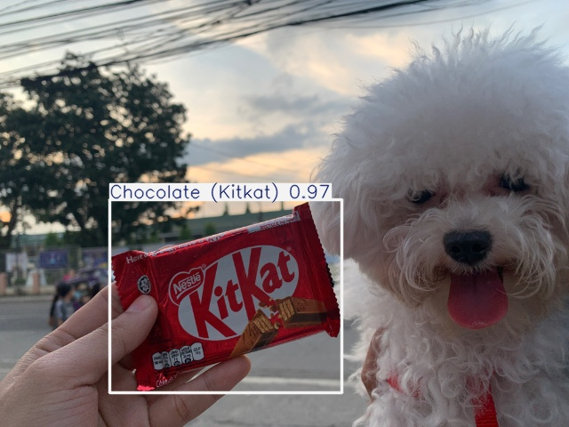

# Start with this



1. Clone the repository on your local machine. Make sure you have git installed to begin with.
```bash
git clone https://github.com/GeyzsoN/object_detection_for_beginners.git
```

2. Next, setup the virtual environment by creating and activating it, and then install the requirements.
```bash
python -m venv myvirtualenvironment

source myvirtualenvironment/bin/activate

pip install -r requirements.txt
```

3. After that, setup the environment on the `training.ipynb`. Go to `training.ipynb` and on the upper right, click select kernel, then select python environments, then select myvirtualenvironment

4. Next, make sure to configure the path to the `detection.yaml` file. The path directive should point to the path of the root folder for thedataset. In this case, it should point to the kitkat_dataset. If you are on vscode, just right click the folder, copy path, and then paste the copied path to the `detection.yaml`. make sure to remove unnecessary suffixes on the path. The final path should end with `/kitkat_dataset/` or else the training wont work. But if it still doesnt work, please do read the warning/error on the `training.ipynb` and refer to the ultralytics documentation.

5. That's pretty much it to get started. Please do make sure to read the comments I made on the `training.ipynb` file and then check the directory in which the predicted images are located.